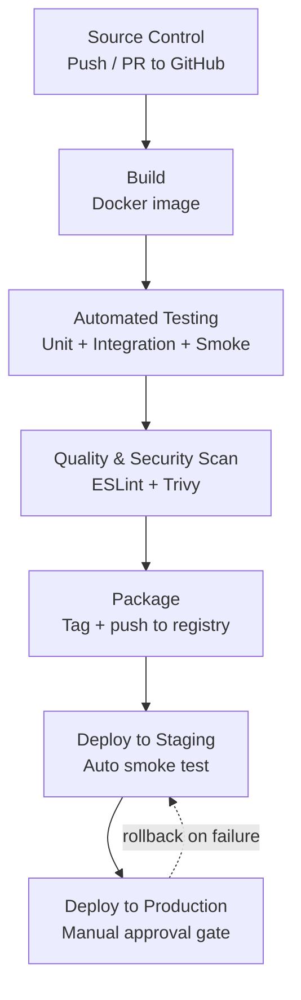

# Smart Construction PMS 
## CI/CD Pipeline

```mermaid
flowchart TD
    A[Source Control<br/>Push / PR to GitHub] --> B[Build<br/>Docker image]
    B --> C[Automated Testing<br/>Unit + Integration + Smoke]
    C --> D[Quality & Security Scan<br/>ESLint + Trivy]
    D --> E[Package<br/>Tag + push to registry]
    E --> F[Deploy to Staging<br/>Auto smoke test]
    F --> G[Deploy to Production<br/>Manual approval gate]
    G -.rollback on failure.-> F
```